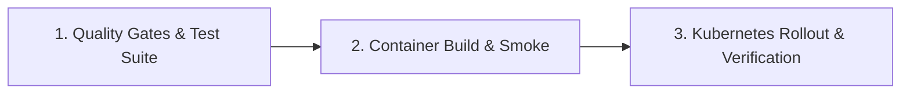

# CI/CD Pipeline & GitHub Actions

> **Status:** Finalized (Phase 12: Production Deployment & Operational Readiness)  
> **Workflow File:** `.github/workflows/deploy.yml`  
> **Trigger Events:** Push to `main`, release tags (`v*.*.*`), pull requests to `main`, manual `workflow_dispatch`.

---

## 1. Pipeline Architecture

The continuous integration and continuous deployment pipeline is structured into three strictly sequential jobs:

---

## 2. Job 1: Quality Gates & Automated Verification (`test`)

Runs automatically on every pull request and push to `main`. All gates must pass before container build proceeds.

### Steps:
1. **Repository Checkout & Environment Setup:**
   - Python 3.11 with pip caching.
   - Node.js 20 with npm lockfile caching.
2. **Dependency Installation:**
   - Production dependencies (`requirements.txt`).
   - Security audit tooling (`requirements-security.txt`).
   - Linters and testing frameworks (`black`, `flake8`, `mypy`, `pytest`, `pytest-cov`, `playwright`).
3. **Static Analysis & Formatting:**
   - Code formatting check: `black --check src/ tests/ scripts/`
   - Linting check (88-character ceiling): `flake8 --max-line-length=88 src/ tests/ scripts/`
   - Static type checking: `mypy src scripts`
4. **Automated Security Scanners:**
   - Security AST audit: `python scripts/security_ast_audit.py`
   - Secret leak audit: `python scripts/security_secret_scan.py`
   - Dependency vulnerability audit: `pip-audit -r requirements.txt`
5. **Automated Test Suites:**
   - Backend unit/integration tests with $\ge 80\%$ coverage gate: `pytest tests/ --cov=src --cov-fail-under=80 -m "not performance"`
   - Frontend unit test suite: `npm run test` (Vitest)
   - Frontend TypeScript type check: `npm run type-check` (tsc)
   - Frontend production build: `npm run build` (Vite)
   - End-to-end browser smoke tests: `pytest tests/test_e2e_playwright.py`

---

## 3. Job 2: Multi-Stage Container Build (`build`)

Executes upon successful completion of Job 1.

### Steps:
1. **Docker Buildx Initialization:** Configures container build environment.
2. **Multi-Stage Build:**
   - Stage 1: `node:20-alpine` builds the React/TypeScript SPA into `dist/`.
   - Stage 2: `python:3.11-slim` compiles Python wheels into `/wheels`.
   - Stage 3: `python:3.11-slim` installs wheels into an unprivileged runtime image (`appuser`, UID 1000).
3. **Local Container Smoke Test:**
   - Launches local container instance on port 8000.
   - Awaits healthy response from Python stdlib `/health` probe.
   - Verifies Prometheus metrics exposition at `/metrics`.
   - Stops and cleans up container.
4. **Publish to GitHub Container Registry (GHCR):**
   - Triggered on push to `main` or release tag (`v*.*.*`).
   - Tags: `ghcr.io/<owner>/<repo>:<sha>` and `latest`.

---

## 4. Job 3: Controlled Kubernetes Rollout (`deploy`)

Executes only for semver release tags (`v*.*.*`) or manual `workflow_dispatch` targeting the `production` environment. Requires environment approval.

### Steps:
1. **Cluster Authentication:** Configures `KUBE_CONFIG` secret.
2. **Infrastructure Manifest Application:**
   - Applies `k8s/pvc.yaml` (PersistentVolumeClaim for SQLite data).
   - Applies `k8s/configmap.yaml` (Production configuration).
   - Applies `k8s/service.yaml` (ClusterIP).
   - Applies `k8s/networkpolicy.yaml` (Egress/Ingress network defense).
3. **Atomic Rollout (`Recreate` Strategy):**
   - Applies `k8s/deployment.yaml` with image updated to immutable SHA tag.
   - Monitors rollout status with 180-second timeout: `kubectl rollout status deployment/search-engine-deployment --timeout=180s`.
   - **Automated Rollback:** If rollout fails or times out, triggers `kubectl rollout undo deployment/search-engine-deployment`.
4. **Ingress Application:**
   - Applies `k8s/ingress.yaml` routing public traffic while blocking `/metrics`.
5. **Post-Deployment Smoke Test:**
   - Executes `scripts/production_smoke_test.py` against live endpoint.
